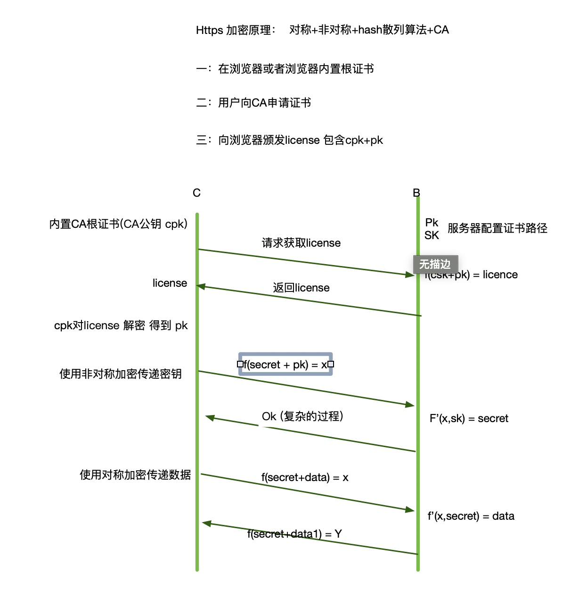

>* 每周技术分享
>* 主题：计算机/Golang/Rust/PHP 等技术/方法论
>* 作者：[luckylsx](https://github.com/luckylsx)，[suhanyujie](https://github.com/suhanyujie)
>* 标签：Rust，csv
>* 期数：20201228-1
>* ps：水平有限，如果内容有误，还请指正。

## topic

### https 的加密 [@luckylsx](https://github.com/luckylsx)
https 的加密方式不只是非对称加密，它其实是结合了对称加密和非对称加密。

### 技术文章渠道 @[suhanyujie](https://github.com/suhanyujie)
1.gopher china 的群，会有 [GoCN 每日新闻](https://gocn.vip/topics)
2.reddit 的 [Rust 频道](https://www.reddit.com/r/rust/)
3.GitHub 的[首页推荐](https://github.com/)
4.掘金 [chrome 扩展](https://juejin.im/extension/)
